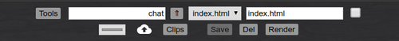
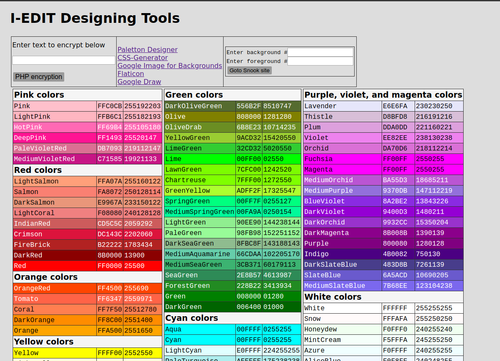

# I-EDIT 

### Internet Editor

I-EDIT is a code editor that runs in your browser
from your web server. 

I-EDIT is built with straight HTML, Javascript and PHP. 
It is licensed as GNU GPL so you can hack the code. 

I-EDIT is built around the "Ace" high performance code editor. 
It is was designed only for web app development. You install it on your web server. 
It is NOT a *WYSIWYG* editor like _Froala_ or _TinyMCE_ but more of an IDE. 
It supports coding in: HTML, Javascript, PHP, CSS, Text, and Markdown,
however, other languages can be added. Theme and syntax highlighting 
can be altered with slight code changes.
File management, file upload, and links to many online tools are supported.

Housing I-EDIT is the web browser. Specifically, 
the browser tabs. I-EDIT will work with any
"Chrome-like" browser > version 24, and Firefox.
  
**Features built around the editor**
  
  * Work in full-tab (editor only) or split-tab (editor and render frame) modes
  * code search, find files, and find in files (grep)
  * Simple text based code Clip management
  * Key word to text-expander based on a JSON file
  * Upload local files
  * File System Access (on server)
    * copy, delete files and directories
  * Text Compare, and Design tools
  * Recognizes .md files. Renders HTML from markdown documents.

---
## Some Details:

* **Written with HTML, CSS, Javascript, PHP**
* **Uses several powerful components:**
  * Ace editor [^1] - [learn more](https://ace.c9.io/ "Ace Editor Website")
  [^1]: Copyright (c) 2010, Ajax.org B.V. All rights reserved.
  * Parsedown - [learn more](https://github.com/erusev/parsedown/blob/master/README.md "Github")
  * highlight.js [^2] - [learn more](https://github.com/highlightjs/highlight.js "Github")
  [^2]: Copyright (c) 2006, Ivan Sagalaev All rights reserved.
  * myJS - my own downsized "_JQuerian_" library [overview](https://mldev.io/TArea/user/doc/myJSrefer.html "mldev.io")
* **Ace Customizations to assist coding:**
  * Ctrl-s => Save
  * Ctrl-r => Render in browser (tab or split frame)
  * Ctrl-Enter => Insert ` `
  * Ctrl-Space => Insert `&nbsp;`
  * Alt-t => Insert date mm/dd/yy
  * Alt-z => Text-Expander keyed on _selected_ text
  * Alt-x => View all text-expander selection keys
  * Alt-a => Wraps _selected_ text:
    * prompt = tag => formats _selected_ text to `<tag>text</tag>`
    * prompt = scase => converts _selected_ text to SentenceCase
    * prompt = `" | '` => wraps _selected_ text in single or double quotes
      _however, Ace does this automatically_
    * prompt = $ => formats _selected_ text to `${text}` 
      Javascript template string
    * prompt = `* | ** | _ | __` => wraps _selected_ text
  * Alt-w => Repeat last Alt-a with new _selected_ text
  * Alt-h => more "Ace" keyboard shortcuts
  * Alt-c => launch Clips _pick_ window
  * Esc => toggle tools menu
* **Here's a few features of the Ace editor**
  * Ctrl-Shift-Left => select word to left
  * Ctrl-Shift-p => select to matching bracket
  * Ctrl-p => go to matching bracket
  * Ctrl-f => find, find all
  * Ctrl-h => replace, replace all
  * Ctrl- , Ctrl+ => font smaller , larger
  * Ctrl-/ => toggle (line or group) comment

  * Pre-themed for HTML, JAVASCRIPT, PHP, CSS, and MARKDOWN languages

  For more details look at [Quick Help](../ieditHelp.html)

### Screen Shots:

You can open browser tabs as all editor (iedit.html) or split editor and render frame (iedit2.html)

code clips and links can all be changed

# Installation

Your server:
  * LAMP (~~MySQL~~)
  
on your server:
  * create a home directory for I-EDIT
  * unzip i-edit.zip into that directory  
    some other folders will be created
  * make sure permissions are set correctly  
    for all the new files
    
from your browser:
  * .../home/iedit.html
    will launch the full page editor
  * .../home/iedit2.html
    will launch the split page editor
    
e n d

