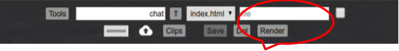

**I-EDIT server based IDE**  
**User Guide**  
`ieditHelp`

_<center>An advanced web based code editor for the LAMP fullstack developer.</center>_

<small>
This project is coded without "bells and whistles."
The assumption is that user's of this application are coders who would know
how to modify the code to their own preferences - enhancements. For user's just
learning how to code the operation is straight forward.
Also, for students, a "look under the hood" provides some solid code samples.
</small>

# File System Actions



| sym | input   | click | example         | explanation |
|:---:| :---:   | :---  | :---            | :--- |
|  /  |directory|Save   | `/newdir`       | create new directory under current dir |
|  -  |file     |Save   | `-curfile.js`   | minify current js file to curfile.min.js * |
|  <  |file     |Save   | `<fullpath/file`| copy a fullpath/file to the current directory|
|  +  |directory|Save   | `+fullpath/dir` | copy current directory & files to new directory |
|     |file     |Del    | `curfile.html`  | delete the current file |
|     |_blank_  |Del    |                 | delete the current directory and files |
|     |file mask|Del    | `*.txt`         | delete files with a file mask | 

**Rename (save-as) current file**
: change the file name and _Save_

**Copy current file to different directory**
: change the directory and _Save_

**NOTES**
* JS Minification*  
You may have to re-complile the jsmin program to work on your system  
find at `https://github.com/douglascrockford/JSMin`

* The single checkbox to the right of the file input box may be  
checked to append the next opened file to the current file.

* Hitting Ctrl-s, or hitting Enter in the file input field  
is the same as hitting the "Save" button.  

* The '+' command will not copy subdirectories.

# Explaining Alt-z

If you type a key word, and then hit Alt-z, then previously 
stored text associated with that key word is inserted into your 
code over the key word. The key words and associated text (which you
can modify) are stored in the file **`config/tags.js`**. 
I-EDIT comes with many examples.  
In the editor **Alt-u** opens a new browser tab for editing
the config/tags.js file.

Here are the first six lines of ```config/tags.js```:
```json
const atags = {
	"ajson": "var ajson = [\n	{\"\":\"\"},\n	{\"\":\"\"}\n	];\n",
	"a": "<a href=\"\" id=\"\" target=\"_blank\"></a>",
	"br": "<br style=\"clear:left;\">",
	"button": "<input type=\"button\" onclick=\"\" value=\"\">",
	"checkbox": "<label for='AA'>description</label>\n<input type='checkbox' id='AA' name='postfield' value='postvalue'>",
```

For example, if you type `html`, and hit Alt-z 
the following code (which is stored in config/tags.js) would be inserted:
```html
<!DOCTYPE HTML>
<html lang="en-US">
<head>
	<meta charset='UTF-8'>
	<meta name='viewport' content='width=device-width, initial-scale=1'>
	<title></title>
</head>
<body>

</body>
</html>
```
If you hit Alt-z after typing something that is NOT a key word defined in tags.js,  
then it creates a tag pair with with the word you typed:
```html
<span></span> <!-- span was not a key word in tags.js file -->
```
_Note:_ The _Ace Editor creates a tag pair automatically (in html file) by
inserting the closing tag after you've typed
the opening tag_.

# Explaining *Alt-a* (and *Alt-w*)

If you select some text and click Alt-a, a prompt will then ask you  
to enter a `tag` name or * | ** | $ | _ | __  
Your selected text is now enclosed with the tag name you entered
or the special characters you entered.

Examples (you select `text`)
* you entered `small` in the prompt  
`<small>text</small>`

* you entered `**` in the prompt  
`**text**`

* you entered `$` in the prompt  
`${text}`

* see below for all the Alt-a commands

### Alt-w repeats the last Alt-a action

if you click Alt-a without selecting text, a prompt will then ask you
to enter a _key word_. Code associated with the key word will then
insert into your text as it does with Alt-z.

# Keyboard Shortcuts

The _Ace_ editor of course comes with many keyboard shortcuts,  
and we've added a few more with I-EDIT.

__*See ALL keyboard shortcuts with Ctrl-Alt-h*__ (_active when editor has focus_)

## I-EDIT Added Shortcuts

(_active when editor has focus_)
* __Ctrl-s__ => Saves the file
* __Ctrl-r__ => Render current file in frame or new tab
* __Ctrl-Enter__ => Insert `<br>` at cursor position
* __Ctrl-Space__ => Insert `&nbsp;` at cursor position
* __Alt-t__ => insert mm/dd/yyyy date at cursor position
* __Alt-z__ => Insert extended text for key word (tags.js)  
  Default: make tag using selected text `<text></text>`
* __Alt-x__ => view all commands in the tags.js file
* __Alt-a__ => wraps **SELECTED** text after prompting for input   
  prompt = _tag_ => formats **selected** text to `<tag>text</tag>`  
  prompt = **scase** => converts **selected** text to SentenceCase  
  prompt = **$** => formats **selected** text to `${text}` template string  
  prompt = `* | ** | _ | __` => wraps **selected** text `**text**`  
  prompt = **/** => partial line comment Php, Javascript `/* comment */`  
  prompt = **!** => partial line comment html `<!-- comment -->`  
  prompt = **'** => wraps **selected** text in single quotes  
  prompt = **"** => wraps **selected** test in double quotes
* __Alt-w__ => Repeat last __Alt-a__ with new selected text
* __Alt-c__ => launch Clips and Links window (uses webdev.dat)
* __Alt-h__ => this help page
* __Alt-u__ => opens new browser tab to edit config/tags.js file
* __Alt-n__ => opens new "full editor" browser tab with current file
* __Ctrl-Alt-n__ => opens new "Half editor" tab with current file
* __Esc__ => toggle tools menu
* __Ctrl-Alt-h__ => view __all__ keyboard shortcuts


## Some Useful _Ace_ Shortcuts

(_active when editor has focus_)

* __Ctrl-Shift-Left__ => select word to left
* __Ctrl-Shift-p__ => select to matching bracket
* __Ctrl-Alt & left-mouse__ => select columns
* __Ctrl-p__ => go to matching bracket
* __Ctrl-f__ => find, find all
* __Ctrl-h__ => replace, replace all
* __Ctrl-__ , __Ctrl+__ => font smaller , larger
* __Ctrl-/__ => toggle (line or group) comment

[Ace built-in shortcuts](https://ace.c9.io/demo/keyboard_shortcuts.html "https://ace.c9.io/")

__*See ALL keyboard shortcuts with Ctrl-Alt-h*__ (_active when editor has focus_)

<br>
# System Files

FILES AND DESCRIPTIONS:  
where 'root' is the I-EDIT 'root' folder
not necessarily the web server root.
```text
root/config/cssdom.html - document object properties
root/config/cssstyle.html - css for Javascript
root/config/exec.php - grep & find utility page
root/config/tags.js - file for (Alt-z) key word extensions
root/config/webdev.dat - clips text file
root/iedit.html - the text editor
root/iedit2.html - combined editor & render frames
root/ieditCmp.html - compare 2 texts (files)
root/ieditDevL.html - clips and links page
root/ieditDevL.php - handler for ieditDevL.html
root/ieditHand.php - file handler for iedit.html
root/ieditHelp.html - this file
root/ieditKeyCuts.html - "Ace" keyboard shortcuts
root/ieditres9.php - design tools
root/ieditrt1.html - realtime HTML/JS
root/ieditrt2.html - realtime HTML/JS 
root/ieditTools.html - tools menu for iedit.html
root/ieditUfile.php - file upload
root/ieditUhand.php - file upload handler
root/images/... - image files
root/js/... - myJS-1.2.min.js and myJS-1.2.js ...
root/jsmin - Douglas Crockford JS minify program
root/md.pdf - markdown guide pdf
root/min.sh - shell script used to process jsmin
root/phpen/... - realtime php testing

root/...? - other files you may need ...

root/domain-1/app files and sub directories
root/domain-2/app files and sub directories
root/domain../app files and sub directories
```


end 10/01/2019

