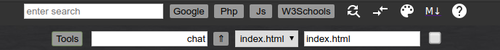
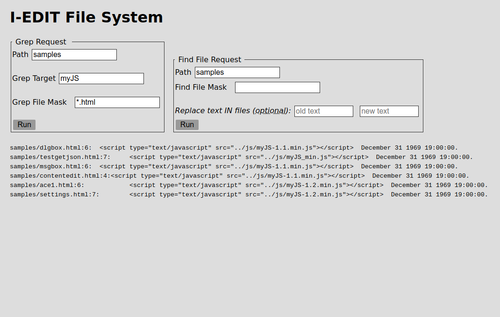

# I-Edit 

### Internet Editor

I-Edit is a server based code editor that you
run in your browser.

It is licensed as GNU GPL so you can hack the code. 

I-Edit is a web app built around the "Ace" high performance code editor. 
It is NOT a *WYSIWYG* editor, it is a code editor.
It is designed for web app development. You install it on your web server. 
Out of the box it is set up for LAMP full stack developement.
Themes, languages, and syntax highlighting can be altered with slight changes.
File management, file upload, and links to many online tools are supported.
I-Edit was used to build a better version of itself.

I-Edit is a web app and therefore relies heavily on Javascript/HTML5 and the
MDI and other functions of the web browser. I-Edit will work with any
Chromium based browser > version 24, and Firefox.
  
**Features built around the editor**
  
* Work in full-tab (editor only) or split-tab (editor and render frame) modes
* code search, find files, and find in files (grep)
* Simple text based code Clip management
* Key word to text-expander based on a JSON file
* Upload local files
* File System Access (on server)
  * create, copy, delete files and directories
* Text Find and Replace (on server)
* Markdown capable for .md files

* Written with HTML, CSS, Javascript, PHP
* **Uses several powerful components:**
  * Ace editor [^1] - [learn more](https://ace.c9.io/ "Ace Editor Website")
  [^1]: Copyright (c) 2010, Ajax.org B.V. All rights reserved.
  * Parsedown - [learn more](https://github.com/erusev/parsedown/blob/master/README.md "Github")
  * highlight.js [^2] - [learn more](https://github.com/highlightjs/highlight.js "Github")
  [^2]: Copyright (c) 2006, Ivan Sagalaev All rights reserved.
  * myJS - my own downsized "_JQuerian_" library [overview](https://github.com/MLeidel/myJS "mldev.io")
  * Pre-themed for HTML, JAVASCRIPT, PHP, CSS, JSON, and MARKDOWN languages

  For more details look at [Quick Help](https://github.com/MLeidel/I-Edit/blob/master/ieditHelp.md)

### Screen Shots:

Open browser tabs as all editor (iedit.html) or split editor and render frame (iedit2.html)

code clips and links can all be changed

# Installation

---

**NOTE: iedit.zip is still being updated frequently**

---

Your server:
  * LAMP (~~MySQL~~)
  
on your server:
  * create a home directory for I-Edit
  * unzip i-edit.zip into that directory  
    some other folders will be created
  * make sure permissions are set correctly  
    for all the new files
    
from your browser:
  * .../*home*/iedit.html
    will launch the full page editor
  * .../*home*/iedit2.html
    will launch the split page editor
    
e n d  10/23/2019

